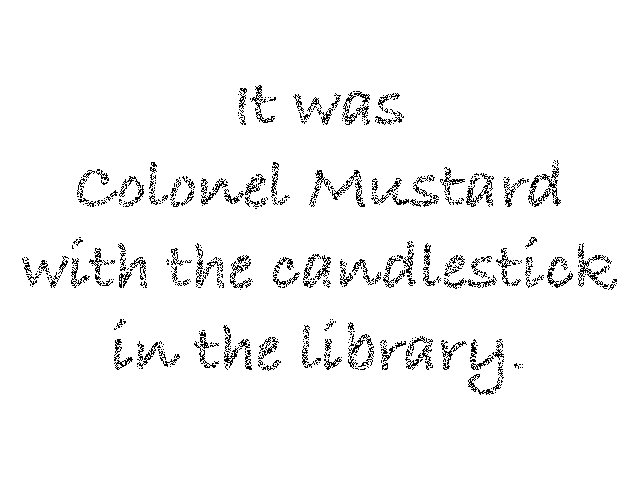
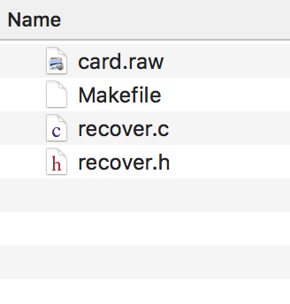
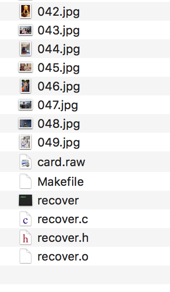

# Harvard cs50 Computer Science Course
Harvard CS50 is a course on edX educational platform.  
https://www.edx.org/course/introduction-computer-science-harvardx-cs50x

## Table of Contents
<!-- MarkdownTOC depth=4 -->
- [Requirements](#requirement)
- [pset1](#pset1): **C Basics**
    - Data types, Operators, Conditionals statements, Loops.
- [pset2](#pset2): **Arrays, Intro to Cryptography**
    - Functions, Variables and Scope, Command Line Args, Arrays.
- [pset3](#pset3): **Algorythms, Intro to Video Games**
    - Sort Algorythms, Computational Complexity, Makefiles.
    - Game of fifteen
- [pset4](#pset4): **Memory, Intro to Forensics**
    - Pointers, Dynamic Memory Allocation, Structures, Recursion, Call Stack.
    - Resize images, recover photos.
- [pset5](#pset5): **Data Structure**
    - Singly-Linked List, Doubly-Linked List, Stacks, Queues, Hash Tables.
    - SpellChecker, Mispellings
- [pset6](#pset6): **Python, Intro to Machine Learning**
    - Analyse some sentiment

<a name="requirement"></a>

## Requirements
You'll have to install the [libcs50](https://github.com/cs50/libcs50) and add the flag -lcs50 when compiling the c files.

<a name="pset1"></a>

## [pset1](./pset1/): C Basics
water.c : a program to convert shower's length (in minutes) to equivalent water bottles
```javascript
$ ./water
minutes: 10
bottles: 120
```

mario.c : a program that recreates half-pyramid using hashes (#) for blocks.
```javascript
$ ./mario
Height: 4
   #  #
  ##  ##
 ###  ###
####  ####
```
credit.c : a program that determines whether a provided credit card number is valid according to Luhn’s algorithm.
```javascript
$ ./credit
Number: 378282246310005
AMEX
```

<a name="pset2"></a>

## [pset2](./pset2/): Arrays, Intro to Cryptography

vigenere.c : a program to vigenere cipher a text
```javascript
$ ./vigenere bacon
Meet me at the park at eleven am
Negh zf av huf pcfx bt gzrwep oz
```

crack.c : a program that cracks passwords, per the below.
```
$ ./crack 50fkUxYHbnXGw
rofl
```

<a name="pset3"></a>

## [pset3](./pset3/): Algorythms, Intro to Video Games
find.c : a program that finds a number among numbers, per the below.
```
$ ./generate 1000 | ./find 42
Didn't find needle in haystack.
```

fifteen.c : a game of fifteen games
```javascript
$ ./fifteen 4

15 14 13 12

11 10  9  8

 7  6  5  4

 3  1  2  _
 
Tile to move:
```

<a name="pset4"></a>

## [pset4](./pset4/): Memory, Intro to Forensics
whodunit.c : a program that intelligently analyze an image (clue.bmp) and turn it to a better image (verdict.bmp)
```javascript
$ ./whodunit clue.bmp verdict.bmp
```
clue.bmp : 


Creation of verdict.bmp : 



resize.c : a program that can enlarge an image to n size
```javascript
$ ./resize 4 small.bmp large.bmp
```

Before and after running resize.c


recover.c : a program that recovers .jpeg images from card.raw
```javascript
$ ./recover card.raw
```



<a name="pset5"></a>

## [pset5](./pset5/): Data Structure, SpellChecker, Mispellings
```javascript
$ ./speller texts/austinpowers.txt

MISSPELLED WORDS

nme
veri
persan
yo
bro
USConstitution
http
usconstitution
const
html

WORDS MISSPELLED:     10
WORDS IN DICTIONARY:  143091
WORDS IN TEXT:        722
TIME IN load:         0.10
TIME IN check:        0.00
TIME IN size:         0.00
TIME IN unload:       0.06
TIME IN TOTAL:        0.16
```

<a name="pset6"></a>

## [pset6](./pset6/): Python, Intro to Machine Learning

### Convert some of pset1 and 2 .c programs to .py
```javascript
$ python mario.py
Height: 4
   #  #
  ##  ##
 ###  ###
####  ####
```

```javascript
$ python credit.py
Number: 378282246310005
AMEX
```

```
$ python crack.py 50fkUxYHbnXGw
rofl
```

### Sentiments
Requirements & Dependencies:
```javascript
cd ~/workspace/pset6/sentiments/
pip3 install --user -r requirements.txt
```
#### Usage: 
```javascript
$ export API_KEY= <insert your API_KEY from Twitter here>
$ export API_SECRET= <insert your API_SECRET from Twitter here>
$ export FLASK_APP=application.py
$ export FLASK_DEBUG=1
$ flask run
```
smile.py : a program that categorizes a word as positive or negative

[](https://postimg.org/image/907cgxu95/)

tweets.py categorizes a user’s recent 100 tweets as positive or negative (uses Twitter API)

[](https://postimg.org/image/4u0a0jmlz/)

Implement a website that generates a pie chart categorizing a user’s tweets
[](https://postimg.org/image/o2ar8a7br/)
